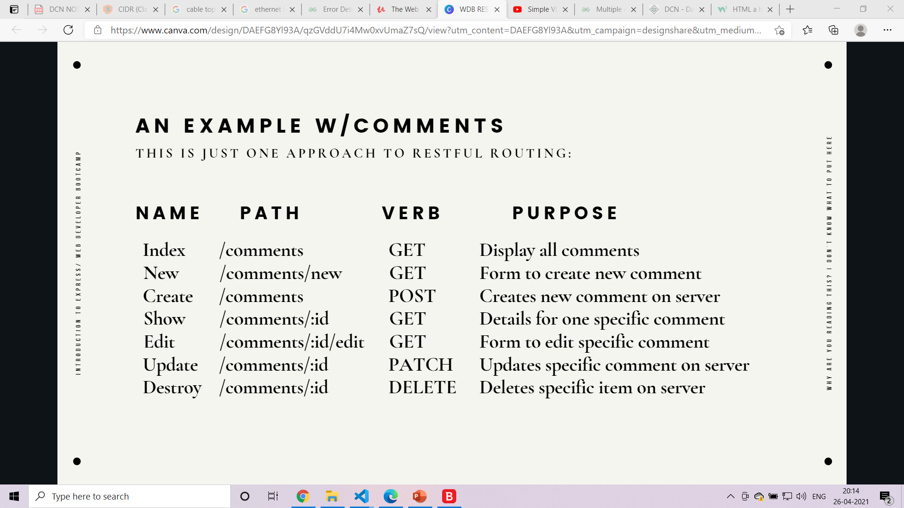

# NODEJS

## Creating files and folders

```javascript
const fs = require("fs");
const projectName = process.argv[2].toString();
console.log(projectName);
try {
  fs.mkdirSync(projectName); //create folder
  fs.writeFileSync(`${projectName}/app.js`, "");
  fs.writeFileSync(`${projectName}/style.css`, ""); //create a file
  fs.writeFileSync(`${projectName}/index.html`, "");
} catch (e) {
  console.log(e);
}
```

---

## Exports and modules

```javascript
const pi = 3.14;
const add = (x, y) => x + y;
const square = (x) => x * x;
const math = {
  pi: pi,
  add: add,
  square: square,
};
module.exports = math; //====OR=========================
//===================================================
// module.exports.pi=pi;
// module.exports.add=add;
// module.exports.square=square;
```

---

## Requiring a Directory

cat1.js

```javascript
module.exports = {
  name: "cat1",
  color: "red",
};
```

cat2.js

```javascript
module.exports = {
  name: "cat2",
  color: "blue",
};
```

index.js

```javascript
const cat1 = require("./cat1.js");
const cat2 = require("./cat2.js");
const allCats = [cat1, cat2];
module.exports = allCats;
```

### When requiring a directory Node looks for index.js <br>

app.js

```javascript
const shelter = require("./shelter");
console.log("required an entire directory", shelter);
```

### output:

```
required an entire directory [ { name: 'cat1', color: 'red' }, { name: 'cat2', color: 'blue' } ]
```

the file directory looks like below shown

```
shelter
    index.js
    cat1.js
    cat2.js
app.js
```

---

## NPM packages

```javascript
const jokes = require("give-me-a-joke");
jokes.getRandomCNJoke((joke) => {
  console.log(joke);
});
```

## installing packages locally and globally

<b>locally</b>: npm install package-name<br>
<b>globally</b>: npm install -g package-name

---

## Making a new project

<b>making a package.json file :

```
npm init
```

adding dependency :

```
npm i 'package name'
```

ex :

```
npm i figlet
```

### installing all dependencies requiered

```
npm install => this is done terminal in folder which contains package.json
```

---

# EXPRESS

```javascript
const express = require("express");
const app = express();
app.use(() => {
  //every time user uses one of the port in listen
  console.log("server requested");
});
app.listen(3000, () => {
  console.log("listening for requests"); //listening for connections
});
```

REQUESTS AND RESPONSE

```JAVASCRIPT
app.use((req,res)=>{         //every time user uses one of the port in listen
    console.log("server requested");
    res.send("<h1>thank you for using site</h1>") //USING RES OBJECT
});

```

ROUTING BASICS

```javascript
const express = require("express");
const app = express();
// app.use((req,res)=>{                           //every time user uses one of the port in listen
//     console.log("server requested");
//     res.send("<h1>thank you for using site</h1>")
// });
app.get("/", (req, res) => {
  //localhost:3000
  res.send("<h1>this is a home page</h1>");
  console.log("this is a home page");
});
app.get("/page1", (req, res) => {
  //localhost:3000/page1 for get
  res.send("<h1>your at page 1</h1>");
  console.log("your at page 1");
});
app.post("/page1", (req, res) => {
  //localhost:3000/page1 for post
  res.send("<h1>your at page 1</h1>");
  console.log("your at page 1");
});
app.get("*", (req, res) => {
  //if no other route =>must be the last route
  res.send("<h1>no such page</h1>");
  console.log("no such page");
});
app.listen(3000, () => {
  console.log("listening for requests"); //listening for connections
});
```

PATH PARAMETERS

```javascript
app.get("/r/:subreddit/:postId", (req, res) => {
  const { subreddit, postId } = req.params;
  res.send(`<h1>Viewing Post ID: ${postId} on the ${subreddit} subreddit</h1>`);
});
```

HANDLING QUERY STRINGS

```JAVASCRIPT
app.get('/search',(req,res)=>{         //localhost:3000/search?q=ddf
    const {q} =req.query;//if you have more queries const {q1,q2,...} = req.query;
    if(q){
    res.send(`<h1>searching for ${q}</h1>`);
    console.log(`searching for ${q}`);
    }
    else{                          //localhost:3000/search
        res.send(`<h1>search for something</h1>`);
    console.log(`search for  something`);
    }
})
```

install nodemon to reset server for every change

---

## DYNAMIC TEMPLATING

```javascript
const express = require("express");
const app = express();
const path = require("path"); //gives the directory of index.js file
app.set("view engine", "ejs"); //so all files rendered will be rendered with .ejs from view folder
app.set("views", path.join(__dirname, "/views")); //so index.js can be runn from any folder or we geterror
app.get("/", (req, res) => {
  res.render("home"); //if we didnt use view engine we have to write home.ejs
});
app.listen(3000, () => {
  console.log("listening on port 3000");
});
```

## EJS

```javascript
res.render("home", { num: num }); //send variable num //sends variable if ejs file requires it
```

ejs file - home.ejs

```
<%= num %> //javascript code goes inside<%= %>
```

---

## ex:

```javascript
const redditData = require("./data.json"); //the json which contains data

app.get("/r/:subreddit", (req, res) => {
  const { subreddit } = req.params;
  const data = redditData[subreddit];
  if (data) {
    res.render("subreddit", { ...data });
  } else {
    res.render("notfound", { subreddit });
  }
});
```

json

```json
{
  "soccer": {
    "name": "Soccer",
    "subscribers": 800000,
    "description": "The football subreddit. News, results and discussion about the beautiful game.",
    "posts": [
      {
        "title": "Marten de Roon to make pizza for more than 1,000 people in Bergamo if Atalanta win the Champions league.",
        "author": "joeextreme"
      },
      {
        "title": "Stephan Lichtsteiner has retired from professional football",
        "author": "odd person"
      },
      {
        "title": "OFFICIAL: Dani Parejo signs for Villareal.",
        "author": "joeextreme"
      }
    ]
  }
}
```

ejs

```html
<head>
  <meta charset="UTF-8" />
  <meta name="viewport" content="width=device-width, initial-scale=1.0" />
  <title><%= name %></title>
  <link rel="stylesheet" href="/app.css" />
</head>

<body>
  <h1>Browsing The <%= name %> subreddit</h1>
  <h2><%= description %></h2>
  <p><%=subscribers %> Total Subscribers</p>
  <hr />

  <% for(let post of posts) { %>
  <article>
    <p><%= post.title %> - <b><%=post.author %></b></p>
    <% if(post.img) { %>
    " alt="" />
    <% } %>
  </article>
  <% } %>
</body>
```

## Serving Static Files

```javascript
app.use(express.static(path.join(__dirname, "public")));
```

here all static files will be in public folder and any files rendered can access these

### ejs

```html
<link rel="stylesheet" href="/style.css" />
```

### file view

```
public
    /style.css
    /app.js
    /img
view
    /subreddit.js
index.js
```

---

## urlencodeddata in post

```
 express.urlencoded()
```

```javascript
//To parse form data in POST request body:
app.use(express.urlencoded({ extended: true }));
```

## ex

```javascript
app.use(express.urlencoded({ extended: true })); //for urlencoded post request
app.post("/tacos", (req, res) => {
  const { meat, qty } = req.body;
  console.log(req.body);
  console.log(`${meat} - ${qty}`);
  res.send(`${meat} - ${qty}`);
});
```

## json in post

```javascript
app.use(express.json());
app.post("/tacos", (req, res) => {
  const { meat, qty } = req.body;
  console.log(req.body);
  console.log(`${meat} - ${qty}`);
  res.send(`${meat} - ${qty}`);
});
```

---

## REST



# CREATE

```javascript
app.get("/comments/new", (req, res) => {
  res.render("comments/new.ejs");
});
```

`ejs file`

```html
<body>
    <form action="/comments" method="POST">
        <input type="text" placeholder="username" name="newName"><br>
        <textarea name="newComment" id="" cols="30" rows="10"></textarea>
        <button>submit</button>
    </form>
</body>
</html>
```

`for post `

```javascript
app.post("/comments", (req, res) => {
  const { newName, newComment } = req.body;
  ide = ide + 1;
  comments.push({ id: ide, name: newName, comment: newComment }); //adding to array
  res.redirect("/comments");
});
```

---

# READ

```javascript
app.get("/comments", (req, res) => {
  res.render("comments/index.ejs", { comments });
});
```

`ejs file`

```html
<h1>COMMENTS</h1>
<% for(let c of comments) {%>
<li>
  <%= c.name %>: <%= c.comment %>
  <a href="/comments/<%= c.id %> ">show comment</a>
  <a href="/comments/<%= c.id %>/edit">edit</a>
</li>
<% } %>
<br />
<a href="/comments/new">newComment</a> //will send to new comment page
```

`showing one comment`

```javascript
app.get("/comments/:id", (req, res) => {
  const { id } = req.params;
  const comment = comments.find((c) => c.id === parseInt(id));
  res.render("comments/show.ejs", { comment });
});
```

`ejs`

```html
<body>
  <h1>Comment <%= comment.id %></h1>
  <p><%= comment.comment %> - <%= comment.name %></p>
  <a href="/comments">go back</a>
</body>
```

---

# UPDATE

to override path in post use

```
npm i methood-override
```

```javascript
app.use(methodOverride("_method")); //method override
app.patch("/comments/:id", (req, res) => {
  const { id } = req.params;
  const newComment = req.body.newComment;
  const foundComment = comments.find((c) => c.id === parseInt(id));
  console.log(newComment);
  foundComment.comment = newComment;
  res.redirect("/comments");
});
```

`ejs file`

```html
<form action="/comments/<%= foundComment.id %>?_method=PATCH" method="post">
  <textarea name="newComment" id="" cols="30" rows="10">
        <%= foundComment.comment %> 
    </textarea
  >
  <button>save</button>
</form>
```

---

# DELETE

```javascript
app.delete("/campgrounds/:id", async (req, res) => {
  await campground.findByIdAndDelete(req.params.id);
  res.redirect("/campgrounds");
});
```

`ejs file`

```html
<form action="/campgrounds/<%= camp._id %>?_method=DELETE " method="post">
  <button>DELETE</button>
</form>
```

---

# Morgan for logging

```
npm i morgan
```

```javascript
const morgan = express.require("morgan");
app.use(morgan("tiny"));
```

---

# next

```javascript
app.use((req, res, next) => {
  req.requestTime = Date.now();
  console.log("first");
  next(); //goes to next middleware
  console.log("first after next");
});
app.use((req, res, next) => {
  console.log("second");
  next();
});
```

output

```
first
second
first after next
```

## using request time middleware

```javascript
app.use((req, res, next) => {
  req.requestTime = Date.now();
  next();
});
app.get("/", (req, res) => {
  console.log(`REQUEST DATE: ${req.requestTime}`); //request time middleware
  res.send("HOME PAGE!");
});
```

## using middleware on particular paths

```javascript
app.use("/dogs", (req, res, next) => {
  //works only for /dogs
  console.log("I LOVE DOGS!!");
  next();
});
```

when no paths are found

```javascript
app.use((req, res) => {
  res.status(404).send("NOT FOUND!");
});
```

verify pass using middleware

```javascript
const verifyPassword = (req, res, next) => {
  const { password } = req.query;
  if (password === "chickennugget") {
    next();
  }
  res.send("YOU NEED A PASSWORD!");
};
app.get("/secret", verifyPassword, (req, res) => {
  res.send(
    "MY SECRET IS: Sometimes I wear headphones in public so I dont have to talk to anyone"
  );
});
```

---

# ejs-mate

```javascript
const ejsMate = require("ejs-mate");
app.engine("ejs", ejsMate);
```

ejs part

```html
<!DOCTYPE html>
<html lang="en">
  <head>
    <meta charset="UTF-8" />
    <meta http-equiv="X-UA-Compatible" content="IE=edge" />
    <meta name="viewport" content="width=device-width, initial-scale=1.0" />
    <title>Document</title>
  </head>
  <body>
    <%- body %>
  </body>
</html>
```

after using boiler plate

```html
<% layout('layouts/boilerplate')%>
<h1>ALL Campgrounds</h1>
<div>
  <a href="/campgrounds/new">ADD campground</a>
</div>
<div>
  <% for(let camp of camps) {%>
  <li><a href="/campgrounds/<%= camp._id  %> "><%= camp.title %> </a></li>
  <% } %>
</div>
```

---

throw error

```javascript
throw new AppError("password required", 401);
```

creating a error handler

```javascript
app.use((err, req, res, next) => {
  console.log("******************************************");
  console.log("*****************ERROR*****************");
  console.log("******************************************");
  console.log(err);
  next(err);
});
```

custom error handler

```javascript
const AppError = require("./AppError");
app.get("/admin", (req, res) => {
  throw new AppError("You are not an Admin!", 403);
});

app.use((req, res) => {
  res.status(404).send("NOT FOUND!");
});
// app.use((err, req, res, next) => {
//     const { status = 500, message = 'Something Went Wrong' } = err;
//     res.status(status).send(message)
// })
```

AppError.js

```javascript
class AppError extends Error {
  constructor(message, status) {
    super();
    this.message = message;
    this.status = status;
  }
}

module.exports = AppError;
```

## asynchronous errors

```javascript
app.get("/products/:id/edit", async (req, res, next) => {
  const { id } = req.params;
  const product = await Product.findById(id);
  if (!product) {
    return next(new AppError("Product Not Found", 404));
  }
  res.render("products/edit", { product, categories });
});
```

- in the above code if given product not found it calls the error to the error handling middle ware
- we us return so the next line with render doesnt run

## We can catch errors with try catch too but to not write too much code we do the below

```javascript
function wrapAsync(fn) {
  return function (req, res, next) {
    fn(req, res, next).catch((e) => next(e));
  };
}

app.get(
  "/products",
  wrapAsync(async (req, res, next) => {
    const { category } = req.query;
    if (category) {
      const products = await Product.find({ category });
      res.render("products/index", { products, category });
    } else {
      const products = await Product.find({});
      res.render("products/index", { products, category: "All" });
    }
  })
);
```

---

# Joi

[link to api](https://joi.dev/api/?v=17.4.2)

this is used for validation

```javascript
const validateCampground=(req,res,next)=>{
    const campgroundSchema=Joi.object({
        campground: Joi.object({
            title: Joi.string().required(),
            price:Joi.number().required().min(0),
            image:Joi.string().required(),
            location:Joi.string().required(),
            description:Joi.string().required()
        }).required()
    })
    const {error} =campgroundSchema.validate(req.body)
    if(error){
        const msg = error.details.map(el=>el.message).join(',')
        throw new ExpressError(msg,400)
    }else{
        next();//or it will stop if no error
    }
}
app.post('/campgrounds', validateCampground,catchAsync(async (req,res,next)=>{
```

---

Express Router

```js
const express = require("express");
const router = express.Router();

router.get("/", (req, res) => {
  res.send("ALL DOGS");
});
router.get("/:id", (req, res) => {
  res.send("VIEWING ONE DOG");
});
router.get("/:id/edit", (req, res) => {
  res.send("EDITING ONE DOG");
});
module.exports = router;
```

```js
const shelterRoutes = require("./routes/shelters");
const dogRoutes = require("./routes/dogs");
const adminRoutes = require("./routes/admin");

app.use("/shelters", shelterRoutes); //route starts with shelters and then joins the router from express Router above
app.use("/dogs", dogRoutes);
app.use("/admin", adminRoutes);
```

## `nested router`

- You can nest routers by attaching them as middleware on an other router, with or without params.You must pass `{mergeParams: true}` to the child router if you want to access the params from the parent router.

```
GET /user -> hello user
GET /user/5 -> hello user 5
GET /user/5/items -> hello items from user 5
GET /user/5/items/6 -> hello item 6 from user 5
```

- here `user` is parent of `item`

```js
const userRouter = express.Router();
const itemRouter = express.Router({ mergeParams: true });
app.use("/user", userRouter);
app.use("/user/:id/item", itemRouter);
```

---

## `cookies`

- storing information on browser

```js
app.get("/setname", (req, res) => {
  res.cookie("name", "henrietta");
  res.cookie("animal", "harlequin shrimp");
  res.send("OK SENT YOU A COOKIE!!!");
});
```

- adding cookies to /setname

```js
const cookieParser = require("cookie-parser"); ////////
app.get("/greet", (req, res) => {
  const { name = "No-name" } = req.cookies;
  res.send(`Hey there, ${name}`);
});
```

- accessing cookies by parsing it from browser where field is `name` and default value if not present is `No-name`

```js
app.use(cookieParser("thisismysecret")); ////////////// where secret is thisismysecret
app.get("/getsignedcookie", (req, res) => {
  res.cookie("fruit", "grape", { signed: true });
  res.send("OK SIGNED YOUR FRUIT COOKIE!");
});

app.get("/verifyfruit", (req, res) => {
  console.log(req.cookies); //does not include signed
  console.log(req.signedCookies); ////list of signed cookies
  res.send(req.signedCookies);
});
```

- we use signed to make sure cookies are not tampered with

---

# `Sessions`

```js
const session = require('express-session'); ///////////
const sessionOptions = { secret: 'thisisnotagoodsecret', resave: false, saveUninitialized: false }
app.use(session(sessionOptions)); //as depreciated do above

app.get('/viewcount', (req, res) => {
    if (req.session.count) {   //if count present
        req.session.count += 1;
    } else {        count created
        req.session.count = 1;
    }
    res.send(`You have viewed this page ${req.session.count} times`)
})

app.get('/register', (req, res) => {
    const { username = 'Anonymous' } = req.query;  //taking username form ssession
    req.session.username = username; //saving the username to session so we can access it from session
    res.redirect('/greet')
})

app.get('/greet', (req, res) => {
    const { username } = req.session;  /////getting username form session
    res.send(`Welcome back, ${username}`)
})
```

for creation of session with expires and maxAge

```js
const sessionConfig = {
  secret: "thisshouldbeasecret",
  resave: false,
  saveUninitialized: true,
  cookie: {
    expires: Date.now() + 1000 * 60 * 60 * 24 * 7, //one week from creation
    maxAge: 1000 * 60 * 60 * 24 * 7,
  },
};
app.use(session(sessionConfig));
```

---

## flash

```js
const session = require('express-session');
const flash = require('connect-flash');////////////

const sessionOptions = { secret: 'thisisnotagoodsecret', resave: false, saveUninitialized: false }
app.use(session(sessionOptions));
app.use(flash());

app.use((req, res, next) => { /////////locals makes it sos we dont need to send it through render
    res.locals.messages = req.flash('success');
    next();
})
app.get('/farms', async (req, res) => {
    const farms = await Farm.find({});
    res.render('farms/index', { farms })
// app.get('/farms', async (req, res) => {
//     const farms = await Farm.find({});
//     res.render('farms/index', { farms ,messages:"succesful "})
app.post('/farms', async (req, res) => {
    const farm = new Farm(req.body);
    await farm.save();
    req.flash('success', 'Successfully made a new farm!');
    res.redirect('/farms')
})
```

ejs

```js
<%= message%>
```

---

## serving static files

For example, use the following code to serve images, CSS files, and JavaScript files in a directory named public:

```js
app.use(express.static("public"));
```

---

## alert with flash

```js
const sessionConfig = {
  secret: "thisshouldbeabettersecret!",
  resave: false,
  saveUninitialized: true,
  cookie: {
    httpOnly: true,
    expires: Date.now() + 1000 * 60 * 60 * 24 * 7,
    maxAge: 1000 * 60 * 60 * 24 * 7,
  },
};
app.use(session(sessionConfig));
app.use(flash());

app.use((req, res, next) => {
  res.locals.success = req.flash("success");
  res.locals.error = req.flash("error");
  next();
});
```

```js
<% if(success && success.length) {%>
<div class="alert alert-success alert-dismissible fade show" role="alert">
  <%= success %>
  <button
    type="button"
    class="btn-close"
    data-bs-dismiss="alert"
    aria-label="Close"
  ></button>
</div>
<% } %>
<% if(error && error.length) {%>
<div class="alert alert-danger alert-dismissible fade show" role="alert">
  <%= error %>
  <button
    type="button"
    class="btn-close"
    data-bs-dismiss="alert"
    aria-label="Close"
  ></button>
</div>
<% } %>
```

for error

```js
router.get(
  "/:id",
  catchAsync(async (req, res, next) => {
    const camp = await campground.findById(req.params.id).populate("reviews");
    if (!camp) {
      req.flash("error", "Cannot find that campground!");
      return res.redirect("/campgrounds");
    }
    res.render("campgrounds/show", { camp });
  })
);
```

for success

```js
router.post(
  "/",
  validateCampground,
  catchAsync(async (req, res, next) => {
    const camp = new campground(req.body.campground);
    await camp.save();
    req.flash("success", "Successfully created Campground");
    res.redirect(`/campgrounds/${camp._id}`);
  })
);
```

---

# [Bycrypt](https://github.com/kelektiv/node.bcrypt.js)

```js
const bcrypt = require("bcrypt");
const hashpw = async (pw) => {
  const hashp = await bcrypt.hash(pw, 12); //where 12 is salt rounds or the time time taken to generate hash
  console.log(hashp);
};
const compare = async (pass, hashedpw) => {
  const res = await bcrypt.compare(pass, hashedpw);
  if (res) console.log("success");
  else console.log("incorrect pw");
};
hashpw("monkey");
compare(
  "monkey",
  "$2b$12$dE7hMudECD6sHMdBgy6M5uFF17xnbQxpVqyHzv7dOVZqN1HKqh5wy"
);
```

---

## registering

```js
app.post("/register", async (req, res) => {
  const { password, username } = req.body;
  const hash = await bcrypt.hash(password, 12);
  const user = new User({
    username,
    password: hash,
  });
  await user.save();
  res.send("registered");
});
```

## login

```js
app.post("/login", async (req, res) => {
  const { username, password } = req.body;
  const foundUser = await User.findOne({ username: username });
  const validPass = await bcrypt.compare(password, foundUser.password);
  if (validPass) {
    res.send("Success");
  } else {
    res.send("invalid username or pw");
  }
});
```

## session

```js
app.use(session({ secret: "notagoodsecret" }));
// in login part
if (validPass) {
  req.session.user_id = foundUser._id;
  res.send("Success");
}
```

## logout

```js
app.post("/logout", (req, res) => {
  req.session.user_id = null;
  //req.session.destroy(); //destroys whole session
  res.redirect("/login");
});
```

---

# authorization

```js
const requireLogin = (req, res, next) => {
  if (!req.session.user_id) {
    return res.redirect("/login");
  }
  next();
};
```

- functional middleware that checks if you are logged in

```js
app.get("/secret", requireLogin, (req, res) => {
  res.render("secret");
});
app.get("/topsecret", requireLogin, (req, res) => {
  res.send("TOP SECRET!!!");
});
```

- above 2 routes only work if you are logged in as we use the `requireLogin`

---

## refactoring

```js
userSchema.statics.findAndValidate = async function (username, password) {
  const foundUser = await this.findOne({ username });
  const isValid = await bcrypt.compare(password, foundUser.password);
  return isValid ? foundUser : false;
};
```

```js
const foundUser = await User.findOne({ username: username });
const validPass = await bcrypt.compare(password, foundUser.password);
// gets changed to
const foundUser = await User.findAndValidate(username, password);
```

- we make a function for model User by using `statics`with the schema

---

- to make so we save automatically and we dont need to write
  password:hash everytime our model is used
  `isModified` with `pre` before saving

```js
userSchema.pre("save", async function (next) {
  if (!this.isModified("password")) return next();
  this.password = await bcrypt.hash(this.password, 12);
  next();
});
```

`we do this so that`

```js
app.post("/register", async (req, res) => {
  const { password, username } = req.body;
  const hash = await bcrypt.hash(password, 12);
  const user = new User({
    username,
    password: hash, ///////////////
  });
  await user.save();
  res.send("registered");
});
////////////////////////////becomes///////////////////////////
app.post("/register", async (req, res) => {
  const { password, username } = req.body;
  const user = new User({ username, password }); //automatically changes password to hashed password
  await user.save();
  req.session.user_id = user._id;
  res.redirect("/");
});
```

---

# [PASSPORT](http://www.passportjs.org/packages/)

```
npm install passport passport-local passport-local-mongoose
```

[pssport-local-mongoose](https://github.com/saintedlama/passport-local-mongoose)

## Schema for user model

```js
const mongoose = require("mongoose");
const Schema = mongoose.Schema;
const passportLocalMongoose = require("passport-local-mongoose");
const UserSchema = new Schema({
  email: {
    type: String,
    required: true,
    unique: true,
  },
});
UserSchema.plugin(passportLocalMongoose);
module.exports = mongoose.model("User", UserSchema);
```

- we pluggin the useSchema to passport

```js
const passport = require("passport");
const LocalStrategy = require("passport-local");
const User = require("./models/user");
```

- we need to include both passport and passport-local in main file

```js
app.use(passport.initialize());
app.use(passport.session());
passport.use(new LocalStrategy(User.authenticate())); //stategy being used
passport.serializeUser(User.serializeUser()); //how do you store data in session
passport.deserializeUser(User.deserializeUser()); //how to get out of session
```

- be sure to use session() before passport.session() to ensure that the login session is restored in the correct order.

## `how to register a user`

```js
app.get("/fakeuser", async (req, res) => {
  const user = new User({ email: "kkk@gmail.com", username: "karthik" });
  const newuser = await User.register(user, "password");
  res.send(newuser);
});
```

## `how to login a user`

```js
router.get("/login", (req, res) => {
  res.render("users/login");
});
router.post(
  "/login",
  passport.authenticate("local", {
    failureFlash: true,
    failureRedirect: "/login",
  }),
  (req, res) => {
    req.flash("success", "Welcome back");
    res.redirect("/campgrounds");
  }
);
```

## authentication to check if logged in to see any page

```js
router.get("/new", (req, res) => {
  if (!req.isAuthenticated()) {
    req.flash("error", "You need to be logged in");
    return res.redirect("/login"); //return so that both redirect and render dont run
  }
  res.render("campgrounds/new");
});
```

- in the above req.isAuthenticated checks if looged in and if not redirects to login page

---

## middleware that does the above thing

```js
const isLoggedIn = (req, res, next) => {
  if (!req.isAuthenticated()) {
    req.flash("error", "You need to be logged in");
    return res.redirect("/login"); //return so that both redirect and render dont run
  }
  next(); //else
};
```

- we can add this middleware to all routes that needs login

---

## `logout`

```js
router.get("/logout", (req, res) => {
  req.logout();
  req.flash("success", "Good Bye");
  res.redirect("/campgrounds");
});
```

## `req.user`

```js
app.use((req, res, next) => {
  res.locals.currentUser = req.user; /////////
  res.locals.success = req.flash("success");
  res.locals.error = req.flash("error");
  next();
});
```

```js
<% if(!currentUser){ %>
<a class="nav-link" href="/login">Login</a>
<a class="nav-link" href="/register">Register</a>
<% }else{%>
<a class="nav-link" href="/logout">LogOut</a>
<% } %>
```

- gives us the user details if we are logged in

---

## `req.login`

```js
router.post(
  "/register",
  catchAsync(async (req, res) => {
    const { username, email, password } = req.body;
    try {
      const user = new User({ email, username });
      const registeredUser = await User.register(user, password);
      req.login(registeredUser, (err) => {
        /////////////
        if (err) next(err);
        req.flash("success", "Welcome to Yelp Camp!");
        res.redirect("/campgrounds");
      });
    } catch (e) {
      req.flash("error", e.message);
      res.redirect("/register");
    }
  })
);
```

- this directly logs in the user after registering

---

## creating variables inn session to return to the page you wanted to visit before logging in

```js
const isLoggedIn = (req, res, next) => {
  if (!req.isAuthenticated()) {
    req.session.returnTo = req.originalUrl; //////
    req.flash("error", "You need to be logged in");
    return res.redirect("/login"); //return so that both redirect and render dont run
  }
  next(); //else
};
```

- req.originalUrl gives the complete path

```js
router.post(
  "/login",
  passport.authenticate("local", {
    failureFlash: true,
    failureRedirect: "/login",
  }),
  (req, res) => {
    const redirectUrl = req.session.returnTo || "/campgrounds"; ///if returnTo not present then '/campgrounds'
    req.flash("success", "Welcome back");
    console.log(redirectUrl);
    delete req.session.returnTo; //deleting it
    res.redirect(redirectUrl);
  }
);
```

---

# associating a user to campground

```js
const CampgroundSchema = new Schema({
  title: String,
  image: String,
  price: Number,
  description: String,
  location: String,
  author: {
    type: mongoose.Schema.Types.ObjectId,
    ref: "User", ////////////////////////
  },
  reviews: [
    {
      type: mongoose.Schema.Types.ObjectId,
      ref: "Review",
    },
  ],
});
```

# associating the campground to the user that created it

```js
const camp = new campground(req.body.campground);
camp.author = req.user;
camp.save();
```

- when a new campground created associating that campground to the user that is logged in

---

# how to make it so that only author can ediit or delete page

```js
<% if(currentUser && currentUser._id.equals(camp.author)){ %>
```

- in show page above edit and delete

---

## t stop access of some things when not author

```js
const campground1 = await campground.findById(req.params.id);
if (!campground1.author.equals(req.user._id)) {
  req.flash("error", "You do not have Permission to do that");
  return res.redirect(`/campgrounds/${campground1.id}`);
}
```

# middleware do that on many routes

```js
const isAuthor = async (req, res, next) => {
  const { id } = req.params;
  const camp = await campground.findById(id);
  if (!camp.author.equals(req.user._id)) {
    req.flash("error", "You do not have Permission");
    return res.redirect(`/campgrounds/${id}`);
  }
  next();
};
```

---

# linking user to review

```js
const reviewSchema = new Schema({
  body: String,
  rating: Number,
  author: {
    type: mongoose.Schema.Types.ObjectId,
    ref: "User",
  },
});
```

# how to populate campground review

```js
const camp = await campground
  .findById(req.params.id)
  .populate({
    path: "reviews",
    populate: {
      path: "author",
    },
  })
  .populate("author");
```

as campground

```
campground
       review:
          author
        author
```

---

# middleware to check if the author deleting is the one who created

```js
const isReviewAuthor = async (req, res, next) => {
  const { id, reviewId } = req.params;
  const review = await Review.findById(reviewId);
  if (!review.author.equals(req.user._id)) {
    req.flash("error", "You do not have Permission");
    return res.redirect(`/campgrounds/${id}`);
  }
  next();
};
```

---

## Contorllers

- make a separate directory thet take care of controllers

```js
app.get("/products/:id/edit", async (req, res, next) => {
  const { id } = req.params;
  const product = await Product.findById(id);
  if (!product) {
    return next(new AppError("Product Not Found", 404));
  }
  res.render("products/edit", { product, categories });
});
```

becomes

```js
router.get("/:id/edit", isLoggedIn, isAuthor, catchAsyn(Campground.editCamp));
```

controller folder

```js
module.exports.editCamp = async (req, res, next) => {
  const camp = await campground.findById(req.params.id);
  if (!camp) {
    req.flash("error", "Cannot find that campground!");
    return res.redirect("/campgrounds");
  }
  res.render("campgrounds/edit", { camp });
};
```

---

# restructuring routes using router.route

```js
router.get("/", catchAsync(Campground.index));
router.post(
  "/",
  validateCampground,
  isLoggedIn,
  catchAsync(Campground.createCamp)
);
```

to

```js
router
  .route("/")
  .get(catchAsync(Campground.index))
  .post(validateCampground, isLoggedIn, catchAsync(Campground.createCamp));
```

- make sure no ';' after get

---

# [MULTER]

- Multer adds a body object and a file or files object to the request object. The body object contains the values of the text fields of the form, the file or files object contains the files uploaded via the form.

```html
<form action="/profile" method="post" enctype="multipart/form-data">
  <input type="file" name="avatar" />
</form>
```

dont forget `multipart/form-data`

```js
const express = require("express");
const multer = require("multer");
const upload = multer({ dest: "uploads/" });

const app = express();

app.post("/profile", upload.single("avatar"), function (req, res, next) {
  // req.file is the `avatar` file
  // req.body will hold the text fields, if there were any
});

app.post(
  "/photos/upload",
  upload.array("photos", 12),
  function (req, res, next) {
    // req.files is array of `photos` files
    // req.body will contain the text fields, if there were any
  }
);
```

---

# [DOTENV]()

```js
if (process.env.NODE_ENV !== "production") {
  require("dotenv").config();
}
```

- if code is running in production mode

---

# cloudinary

```js
const cloudinary = require("cloudinary").v2;
const { CloudinaryStorage } = require("multer-storage-cloudinary");

cloudinary.config({
  cloud_name: process.env.CLOUD_NAME,
  api_key: process.env.CLOUD_KEY,
  api_secret: process.env.CLOUD_SECRET,
});
const storage = new CloudinaryStorage({
  //storage
  cloudinary,
  params: {
    folder: "YelpCamp", //storage folder in our cloud account
    allowedFormats: ["jpeg", "png", "jpg"],
  },
});
module.exports = {
  cloudinary,
  storage,
};
```

files where upload is done

```js
const multer = require("multer");
const { storage } = require("../cloudinary");
const upload = multer({ storage }); //where it uploads to storage which we required
```

campground when image is uploaded

```js
[Object: null prototype] {
  campground: [Object: null prototype] {
    title: 'sadsa',
    location: 'sadas',
    price: '23',
    description: 'sdsad'
  }
} [
  {
    fieldname: 'image',
    originalname: 'aggressivecows.png',
    encoding: '7bit',
    mimetype: 'image/png',
    path: 'https://res.cloudinary.com/de4tlcrzr/image/upload/v1635389382/YelpCamp/vlvzmecmcdk82ncfivbt.png',
    size: 268557,
    filename: 'YelpCamp/vlvzmecmcdk82ncfivbt'
  }
]
```

---

image upload
controller file

```js
module.exports.createCamp = async (req, res, next) => {
  const camp = new campground(req.body.campground);
  camp.image = req.files.map((f) => ({
    url: f.path,
    filename: f.filename,
  }));
  camp.author = req.user._id;
  await camp.save();
  console.log(camp);
  req.flash("success", "Successfully created Campground");
  res.redirect(`/campgrounds/${camp._id}`);
};
```

routes

```js
router
  .route("/")
  .get(catchAsync(Campground.index))
  .post(
    isLoggedIn,
    upload.array("image"),
    validateCampground,
    catchAsync(Campground.createCamp)
  );
```

model

```js
const ImageSchema = new Schema({
  url: String,
  filename: String,
});

ImageSchema.virtual("thumbnail").get(function () { //virtual function that creates a property schema but is not present really just used to retrieve data
  return this.url.replace("/upload", "/upload/w_200");
});
const CampgroundSchema = new Schema({
    title: String,
    image: [ImageSchema],
    price: Number,
```

---

# USE CAROUSEL FOR MULTIPLE IMAGES

```js
<div class="carousel-inner">
        <% camp.image.forEach((img,i)=>{%>
        <div class="carousel-item <%= i==0?'active':''%>">
          " class="d-block w-100" alt="..." />
        </div>
        <%  }) %>
```

for editing

```js
const img = req.files.map((f) => ({
  url: f.path,
  filename: f.filename,
}));
camp.image.push(...img);
await camp.save();
```

- here as we get array we change it to ele by spread operator
---
# backend for deleting images
```js
  if (req.body.deleteImages) {
    for (let filename of req.body.deleteImages) {
      await cloudinary.uploader.destroy(filename);
    }
    await camp.updateOne({
      $pull: { image: { filename: { $in: req.body.deleteImages } } },
    });
  }
```
---
# map with [mapbox]
```js
const mbxGeocoding = require("@mapbox/mapbox-sdk/services/geocoding");
const mapBoxToken = process.env.MAPBOX_TOKEN;
const geocoder = mbxGeocoding({ accessToken: mapBoxToken });
```
```js
const fun = async () => {
  const geoData = await geocoder
    .forwardGeocode({
      query: "Paris, France",
      limit: 2,
    })
    .send();
  console.log(geoData.body.features[0].geometry.coordinates);
}  
fun()
```
output
```
[ 2.35183, 48.85658 ]
```
---
# adding the geolocation to db
```js
geometry: {
        type: {
            type: String,
            enum: ['Point'],
            required: true
        },
        coordinates: {
            type: [Number],
            required: true
        }
    },
```
```js
const geoData = geocoder
      .forwardGeocode({
        query: req.body.campground.location, /////
        limit: 2,
      })
      .send();
const camp = new campground(req.body.campground);
camp.geometry = geoData.body.features[0].geometry;/////
```
- add the geometry field
- the above is gjson supported by mongoose
---
# DIsplaying map 
##  [MapBoxGL](https://docs.mapbox.com/mapbox-gl-js/api/markers/)

marker
```js
// Create a new marker.
const marker = new mapboxgl.Marker()
.setLngLat([30.5, 50.5])
.addTo(map);
```
# access data of ejs in frontend scripts
```js
<script>
    const mapToken = '<%-process.env.MAPBOX_TOKEN%>';
    const camp = <%- JSON.stringify(camp) %>;
</script>
```
---
# sanitize html of xss
```js
const sanitizeHtml = require('sanitize-html');
```
- Joi
